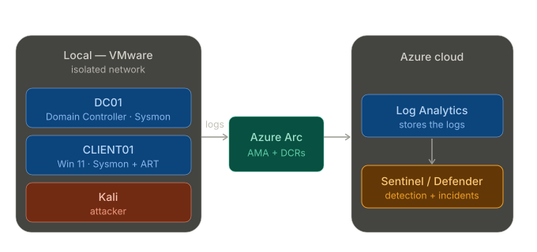

# SOC Detection Lab — MITRE ATT&CK on Microsoft Sentinel

🚧 Work in progress 🚧

Detection-engineering home lab. Adversary techniques emulated with Atomic Red Team,
detected with custom KQL analytics rules in Microsoft Sentinel, mapped to MITRE ATT&CK.

## Architecture

Using VMware, a local isolated network hosts three VMs: CLIENT01 (Windows 11), DC01 (Windows Server 2022 configured as a Domain Controller), and a Kali Linux attacker. Both Windows hosts run Sysmon with the SwiftOnSecurity configuration. Azure Arc connects the two Windows hosts to Azure, where the Azure Monitor Agent (AMA) is deployed to each. Data Collection Rules (DCRs) define which logs the agent collects: the Sysmon Operational log and the Windows Security log. These are forwarded to a Log Analytics Workspace (LAW), where they are stored. Microsoft Sentinel runs on top of the workspace (managed through the Microsoft Defender portal), where KQL-based analytics rules detect malicious activity and raise incidents.

Note: CLIENT01 is currently onboarded to the pipeline. DC01 onboarding is **in progress** and will extend coverage to domain-level telemetry (e.g. Kerberos service-ticket events for Kerberoasting detection).

This is depicted in the below diagram.

## Detection coverage

*[Click to open in ATT&CK Navigator](https://mitre-attack.github.io/attack-navigator/#layerURL=https://raw.githubusercontent.com/alexcolincrawford/mitre-attack-sentinel-detection-lab/main/mitre-att%26ck-coverage/layer.json)*

## Detections

| Technique | Tactic | Status |
|-----------|--------|--------|
| [T1059.001 PowerShell](detections/T1059.001-powershell/writeup.md) | Execution | ✅ Detected |
| [T1059.003 Windows Command Shell](detections/T1059.003%20Windows%20Command%20Shell/writeup.md) | Execution | ✅ Detected |
| [T1547.001 Registry Run Keys](detections/T1547.001-registry-run-key-persistence/writeup.md) | Persistence | ✅ Detected |
| [T1053.005 Scheduled Task](detections/T1053.005-scheduled-task/writeup.md) | Persistence | ✅ Detected |
| T1112 Modify Registry | Defense Evasion | 🔲 Planned |
| T1218.011 Rundll32 | Defense Evasion | 🔲 Planned |
| T1003.001 LSASS Memory | Credential Access | 🔲 Planned |
| T1558.003 Kerberoasting | Credential Access | 🔲 Planned |
| T1087 Account Discovery | Discovery | 🔲 Planned |
| T1018 Remote System Discovery | Discovery | 🔲 Planned |

## Incident triage reports

Multi-technique attack-chain triage scenarios; planned once additional detections are in place

## What I learned

Key takeaways and lessons; added on project completion
