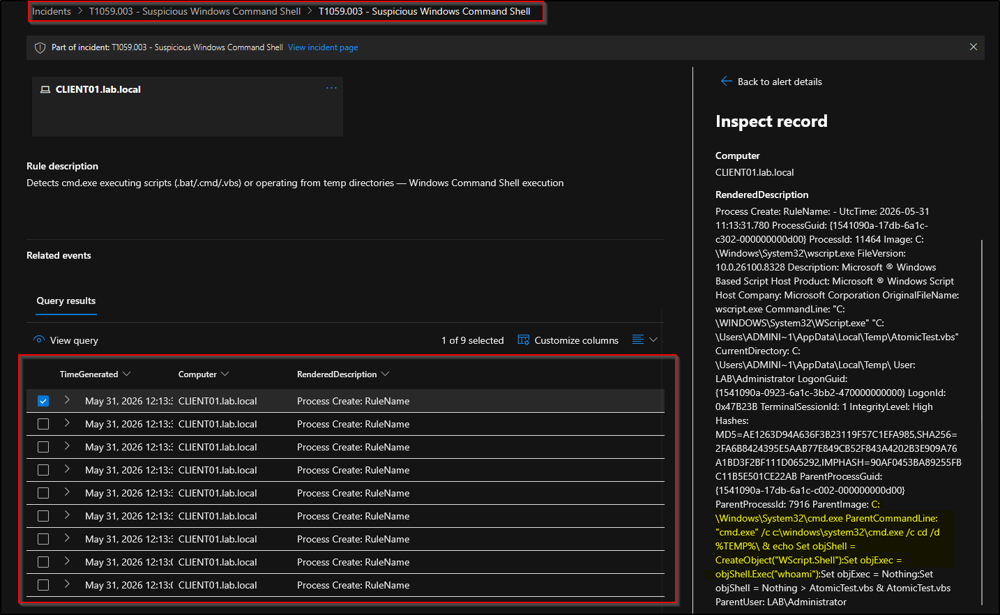
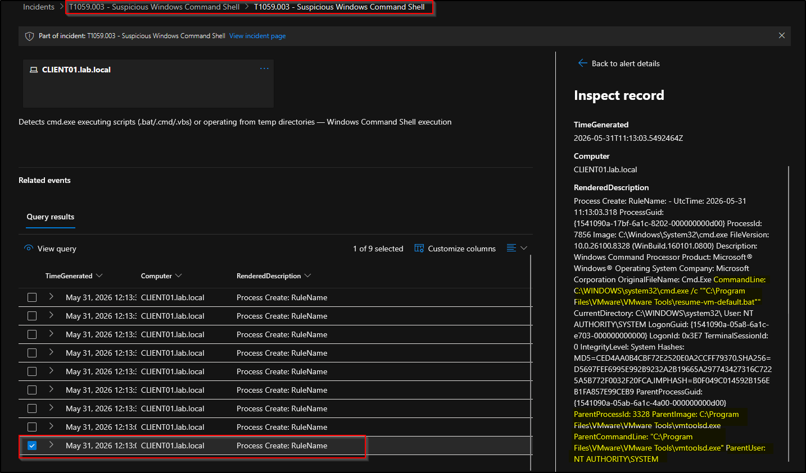

# T1059.003 — Command and Scripting Interpreter: Windows Command Shell
 
**Tactic:** Execution
**ATT&CK:** [T1059.003](https://attack.mitre.org/techniques/T1059/003/)
**Status:** ✅ Detected
 
## Summary
 
The Windows Command Shell (`cmd.exe`) is a common execution mechanism in real intrusions. 
Attackers use it to run batch scripts, stage and execute payloads from temporary directories, and chain into other interpreters. 
This detection identifies `cmd.exe` executing script files (`.bat`/`.cmd`/`.vbs`) or operating out of temp paths, the patterns that distinguish malicious use from ordinary interactive shell usage.

## Emulation
 
Simulated with Atomic Red Team, using the assumed-breach model where tests run directly on
the victim endpoint. From the Atomic Red Team install directory, in an elevated PowerShell
session:
 
```powershell
Import-Module C:\AtomicRedTeam\invoke-atomicredteam\Invoke-AtomicRedTeam.psd1 -Force
Invoke-AtomicTest T1059.003 -GetPrereqs
Invoke-AtomicTest T1059.003 -TestNumbers 1,2,3,5,6
```
> Note: test 4 (BlackByte ransomware print-bombing simulation) was skipped. It repeatedly
> attempts to launch `wordpad.exe`, which no longer ships with Windows 11, causing a flood of
> error dialogs. It is irrelevant to this detection.

Cleanup after testing:
 
```powershell
Invoke-AtomicTest T1059.003 -Cleanup
```
 
## Telemetry source
 
- **Sysmon Event ID 1** (Process Create), collected via Azure Monitor Agent into the
  Log Analytics `Event` table.
- Sysmon configured with the SwiftOnSecurity baseline config.
**Why Sysmon EID 1 and not Windows Security 4688?** Both log process creation, but EID 1 is
richer: it includes the full command line, parent process, parent command line, hashes, and
integrity level. Native 4688 does not log the command line by default and lacks the parent
context, so it would give less to detect on. EID 1 is the stronger source for execution
detections.

 
## Detection logic (via KQL)

Written against the Sysmon-via-AMA schema (`Event` table), string-matching the `EventData` XML field. 

The detection matches `cmd.exe` process-creation events where the command line involves a script file (`.bat`/`.cmd`/`.vbs`) or a temp directory, the patterns the emulated attacks used to stage and run payloads:

```kql
Event
| where Source == "Microsoft-Windows-Sysmon" and EventID == 1
| where EventData has "cmd.exe"
| where EventData has_any (".bat", ".cmd", ".vbs", "%TEMP%")
| project TimeGenerated, Computer, RenderedDescription
| sort by TimeGenerated desc
```

Each filter narrows the data: Sysmon process-creation events → involving `cmd.exe` → where a script extension or temp path appears. Whatever passes all three is the detection hit.

## Sentinel analytics rule
 
| Setting | Value |
|---|---|
| Rule type | Scheduled query |
| Run frequency | Every 5 minutes |
| Lookback | Last 1 hour |
| Alert threshold | Results > 0 |
| Entity mapping | Host → HostName = `Computer` |
| Incident creation | Enabled |
| MITRE mapping | Execution / T1059.003 |
 
**On scheduling:** the lookback (1 hour) is deliberately longer than the run frequency
(5 minutes). Because logs take time to ingest, a lookback equal to the frequency risks an
event landing between windows and being missed. This is something that was not considered in the writeup for [T1059.001-powershell](https://github.com/alexcolincrawford/mitre-attack-sentinel-detection-lab/blob/main/detections/T1059.001-powershell/writeup.md). Although, in production, the severity would dictate the frequency.

## Validation

The rule fired and raised an incident attributed to `CLIENT01.lab.local`, with 9 alerts. The captured event shows the full malicious chain in a single record: `cmd.exe` writing a VBScript to `%TEMP%` and immediately executing it, which spawns `wscript.exe` to run `whoami`:

​```
cmd.exe /c cmd.exe /c cd /d %TEMP%\ & echo Set objShell = CreateObject("WScript.Shell"):Set objExec = objShell.Exec("whoami"):Set objExec = Nothing:Set objShell = Nothing > AtomicTest.vbs & AtomicTest.vbs
​```

The activity ran interactively as `LAB\Administrator`.



## False-positive considerations

The rule fires on benign script execution as well as malicious. Observed false positives in testing:

- **VMware Tools** running `resume-vm-default.bat` (parent: `vmtoolsd.exe`)


*Benign false positive: VMware Tools' `resume-vm-default.bat` executed via cmd.exe, running as NT AUTHORITY\SYSTEM, which distinguishes it from the interactive, user-context attack.*

The discriminator observed in the data: legitimate activity ran as **NT AUTHORITY\SYSTEM in session 0**, while the emulated attack ran **interactively as LAB\Administrator in session 1**. In production this rule would be tuned by excluding known-good parent processes (`vmtoolsd.exe`) and deprioritising SYSTEM-context scheduled scripts.

## Detection lifecycle covered

Emulate (Atomic Red Team) → confirm telemetry (Sysmon EID 1) → detect (KQL analytics rule) → raise incident (Sentinel/Defender) → tune and document false positives.

This writeup covers the full lifecycle, including telemetry-source justification, query-development reasoning, and false-positive analysis.

