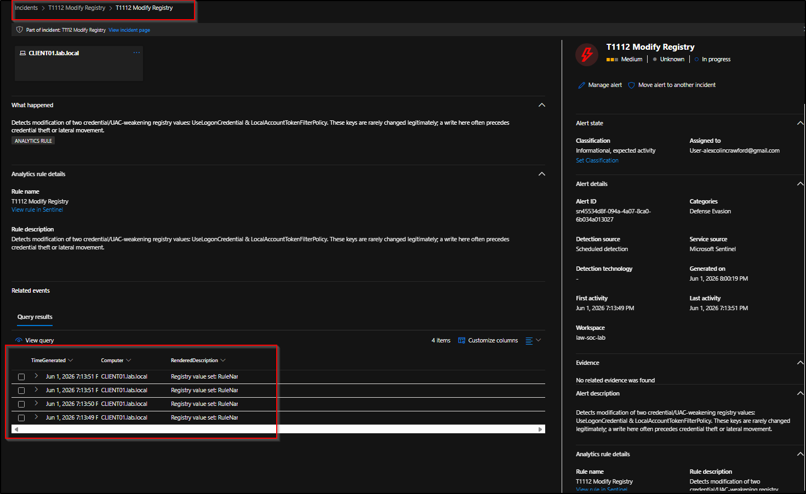
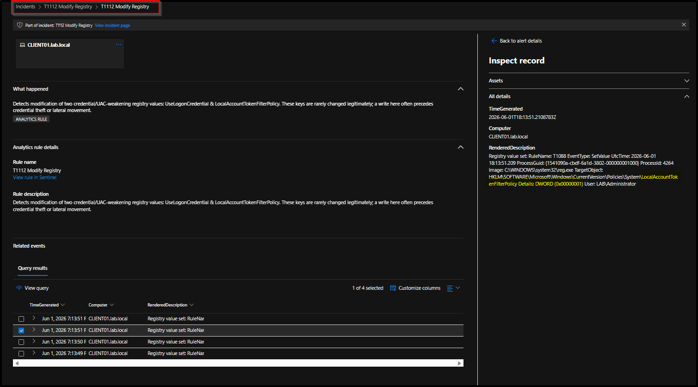

# T1112 — Modify Registry

**Tactic:** Defense Evasion  
**ATT&CK:** [T1112](https://attack.mitre.org/techniques/T1112/)  
**Status:** ✅ Detected

## Summary

This detection focuses on the credential-theft-enabling subset of T1112: rare registry changes that weaken credential protection on an otherwise healthy host.

It does not try to cover all registry abuse, only the values most directly associated with credential dumping.

The two keys in scope are:

- **`UseLogonCredential`** (`HKLM\System\CurrentControlSet\Control\SecurityProviders\WDigest`): when set to `1`, it re-enables WDigest plaintext credential storage in memory. Microsoft disabled this by default in 2014, so enabling it can expose cleartext passwords in a later LSASS/Mimikatz dump.
- **`LocalAccountTokenFilterPolicy`** (`HKLM\SOFTWARE\Microsoft\Windows\CurrentVersion\Policies\System`): when set to `1`, it disables remote UAC filtering for local admin accounts, so remote logons keep full admin rights. This can help lateral movement with reused or stolen local-admin credentials.

For both keys, `1` is the dangerous value.

## Emulation

Simulated with Atomic Red Team, using the assumed-breach model where tests run directly on the victim endpoint. From the Atomic Red Team install directory, in an elevated PowerShell session:

```powershell
Import-Module C:\AtomicRedTeam\invoke-atomicredteam\Invoke-AtomicRedTeam.psd1 -Force
Invoke-AtomicTest T1112 -GetPrereqs
Invoke-AtomicTest T1112
```

Cleanup after testing to return the host to a known-good state:

```powershell
Invoke-AtomicTest T1112 -Cleanup
```

T1112 has many atomic tests spanning different sub-behaviours. The two tests that map to this detection are the credential-storage tests (`Modify registry to store logon credentials`, and its PowerShell variant), which write `UseLogonCredential` and `LocalAccountTokenFilterPolicy`.

## Telemetry source

- **Sysmon Event ID 13** (Registry Value Set), collected via Azure Monitor Agent into the Log Analytics `Event` table.
- Sysmon configured with the SwiftOnSecurity baseline config.

**Why Sysmon EID 13 (not EID 1)?** The other detections in this lab key off process creation because the technique is a process being run. T1112 is different: the malicious act is a **registry write**, so the natural telemetry is the registry-set event itself, which is Sysmon EID 13.

## Detection logic

Written against the Sysmon-via-AMA schema (`Event` table), string-matching the raw `EventData` field. The rule matches a write to either key and a value of `1`:

```kql
Event
| where Source == "Microsoft-Windows-Sysmon"
| where EventID == 13
| where EventData has_any ("UseLogonCredential", "LocalAccountTokenFilterPolicy")
| where EventData contains "DWORD (0x00000001)"
| project TimeGenerated, Computer, RenderedDescription
| sort by TimeGenerated desc
```

### Why scope to two keys

T1112 is a category, not a single behaviour. A rule that fired on any registry write would be unworkable, because a normal host generates thousands of benign writes for software configuration, OS housekeeping, and telemetry.

The two chosen keys share a useful property: they are quiet in normal operation but high-signal when changed. They are rarely changed in normal operations, and when they are set to `1` the intent is usually credential theft or lateral movement.

### Why value-match on `0x00000001`

`DWORD (0x00000001)` is hex for the value `1`, the dangerous setting for both keys. Matching the value, not just the key, means the rule fires on the attack (`= 1`) and ignores a write back to `0` (the safe or remediation direction). This works cleanly here because both keys are malicious when set to `1`.

## Sentinel analytics rule

| Setting | Value |
|---|---|
| Rule type | Scheduled query |
| Run frequency | Every 5 minutes |
| Lookback | Last 1 hour |
| Alert threshold | Results > 0 |
| Event grouping | All events into a single alert |
| Suppression | On, stop for 1 hour after an alert |
| Entity mapping | Host → HostName = `Computer` |
| Incident creation | Enabled |
| Severity | Medium |
| MITRE mapping | Defense Evasion / T1112 |

## Validation

The rule fired and raised a single incident attributed to `CLIENT01.lab.local`, grouping **4 related registry writes**: the two target keys, each written by both `powershell.exe` and `reg.exe`.



The captured inspect record confirms the detection end to end: `reg.exe`, run by `LAB\Administrator`, setting `HKLM\...\CurrentVersion\Policies\System\LocalAccountTokenFilterPolicy` to `DWORD (0x00000001)`.



 The companion `UseLogonCredential` writes appear in the same grouped incident.

.png)


## False-positive considerations

These keys are rarely changed on a healthy host, so the rule is inherently low-noise. In a real environment it would still be tuned by:

- Correlating with the actor and context: a write by an interactive admin during a known maintenance window is different from one by an unexpected process or off-hours.
- Extending coverage deliberately: other known T1112 keys, such as UAC `EnableLUA`, Defender-disable keys, RDP-enable keys, and BitLocker tampering, are out of scope for this rule and would be added as separate validated detections, each with its own key/value logic.

## Detection lifecycle covered

Emulate (Atomic Red Team) → confirm telemetry (Sysmon EID 13) → scope to high-signal keys → detect (KQL analytics rule, value-matched) → raise incident (Sentinel/Defender) → grouping and suppression to collapse duplicate writes → false-positive analysis → document (this writeup).
